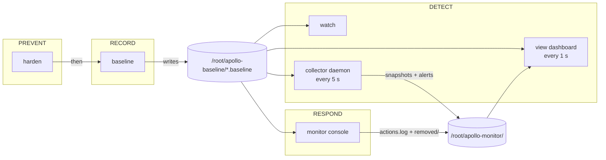

# 01: Architecture

How `apollo-master.sh` is put together: components, data flow, and where state lives.

---

## Big picture



One script, one entry point (`case "$MODE"` at the bottom), shared state-collection functions used by every mode.

## The core idea: baseline → diff

Everything in the detect/respond half is a **diff against a known-good snapshot**.

1. `baseline` records the state right after hardening, when the defender has verified the box is healthy.
2. Later, the same collectors run again and their output is compared to the baseline with `diff` / `comm`.
3. Only lines that are **new** (`>` / `+`) are reported. Lines that vanished are shown as `-` for accounts (a removed user is also worth knowing about).

Because both sides go through the *same* collector function, the comparison is apples-to-apples — the source of two bugs fixed early (see [04-design-decisions-and-bugs](04-design-decisions-and-bugs.md)).

## Function map (by section)

| Section | Functions | Role |
|---|---|---|
| Look & feel | `ok` `warn` `bad` `info` `step` `banner` `utf8_ok` | Coloured ✔ ▲ ✘ • output; colours disabled automatically when stdout isn't a TTY (logs, systemd) |
| Guard | `require_root` | Every mode refuses to run without root |
| Harden | `harden` | 7-step hardening pass |
| State collection | `procs_now` `ips_now` `snap_accounts` `snapshot` `account_changes` | Produce normalised state text for diffing |
| Baseline / watch | `baseline` `diff_section` `watch_once` `watch_mode` | Freeze state; print only the deltas |
| Daemon | `baseline_30min_snapshot` `collector_loop` `start_collector` `stop_collector` `install_service` `uninstall_service` `service_active` `service_installed` `collector_status_line` | Background sampler, detach handling, systemd unit |
| Dashboard | `render_dashboard` `view_dashboard` `view_cleanup` `baseline_age` `snapshot_age_label` | 1-second live view on the terminal alternate screen |
| Time formatting | `fmt_ts` `now_stamp` `who_pretty` | One clean style everywhere: `Sep 19, 9:12 AM` in tables, `Sep 19 9:12:44 AM` in logs |
| distcc attack watch | `distcc_new_alerts` `distcc_log_new` | Tails `/var/log/distccd.log` for whitelist rejections / malformed requests, which are real attack attempts and not normal compiles |
| Language guard | `lang_guard_tick` `lang_target` `lang_file_bad` `lang_evidence` `lang_unlock` `lang_ssh_acceptenv` `fixlang` | Detect and revert locale/keyboard tampering; runs in the daemon and on demand |
| Firewall | `fw_backend` `fw_block` `fw_list_blocked` `fw_unblock` `own_ssh_ip` | Block/unblock single IPs through ufw or iptables, without cutting off the operator's own session |
| Monitor console | `pwd_track` `pwd_when` `mon_ips` `mon_accounts` `mon_passwords` `mon_mass_passwords` `mon_privileges` `mon_cron` `mon_procs` `view_ps_tree` `view_ss_conns` `view_ss_listen` `hl_sus` `mon_delete_user` `monitor_menu` + helpers `log_action` `confirm` `pause` `user_exists` `is_sudoer` | Interactive response console |

## What is collected

`snapshot()` / `snap_accounts()` produce these files (each as `<name>.baseline` when frozen, `<name>.current` when re-sampled):

| File | Content | Catches |
|---|---|---|
| `accounts` | `name uid shell` for UID ≥ 1000 | New/removed users |
| `sudoers` | `getent group sudo` | Privilege escalation via group membership |
| `sshkeys` | Every `authorized_keys` under `/root` and `/home/*` | Classic key-based persistence |
| `hashes` | `sha256sum` of `/etc/passwd`, `shadow`, `group`, `sudoers`, `sudoers.d/*` + any `uid0:` account | Password changes, new sudoers drop-ins, hidden UID-0 accounts |
| `cron` | All per-user crontabs + `/etc/cron.d` listing | Scheduled persistence |
| `listeners` | `ss -Hntlup` (proto, local addr, process) | New listening port = backdoor |
| `established` | `ss` established connections | Unexpected outbound = reverse shell / C2 |
| `remote_ips` | Unique peer IPs (IPv6-safe) | New remote IP → feed the IP-block step |
| `procs` | `comm user` per line, kernel threads and our own tooling removed | New processes |
| `suid` | Every SUID/SGID file on the root filesystem | Privesc backdoor binaries |

### Normalisation matters
`procs_now` collapses `ps` column padding and drops kernel threads (`PID 2` / `PPID 2`) plus the script's own helper commands (`PROC_NOISE`), otherwise identical processes compare as different and the tool's own `ps`/`sort`/`sed` show up as "new".

## The background collector

```
collector_loop  (every MON_INTERVAL = 5 s)
 ├─ procs_now  → snapshots/<epoch>.procs
 ├─ ips_now    → snapshots/<epoch>.ips
 ├─ new IP?        → log once  ("NEW REMOTE IP")
 ├─ new process?   → log once  ("NEW PROCESS")     vs. snapshot ≈30 min old
 ├─ language/keyboard flipped? → fix it, save evidence, log ("LANG CHANGE") via lang_guard_tick
 ├─ account diff?  → log once  ("ACCOUNT CHANGE")  vs. baseline
 ├─ password hash changed? → log ("PASSWORD CHANGE: <user>") via pwd_track
 ├─ distccd.log has new whitelist-rejection/bad-request lines? → log ("DISTCC ATTACK: …") via distcc_log_new
 └─ prune snapshots older than RETENTION (40 min)
```

- **"Log once"** uses `remote_ips.seen`, `procs.alerted`, `accounts.logged` so a single event isn't repeated every 5 seconds.
- **30-minute window**: `baseline_30min_snapshot` picks the snapshot closest to (but not newer than) 30 min ago. If the daemon is younger than that it falls back to the oldest snapshot ("new since monitoring started").
- **No `set -e`** in daemon code: it runs unattended for hours and one empty `ss` result must not kill it.
- **Detached from the terminal** with `setsid nohup … &` + PID file, so closing SSH doesn't stop it.
- **systemd option** (`install`): unit `apollo-monitor.service`, `Restart=always`, `RestartSec=5`, runs `apollo-master.sh __collector__` as root.

## The live dashboard

`view` redraws every `VIEW_INTERVAL` = 1 s on the terminal **alternate screen** (`\e[?1049h`), cursor hidden, restored on exit or Ctrl+C. It samples live each frame (cheap), so it is a true 1-second view even though the daemon only snapshots every 5 s. Header shows `● ALL CLEAR` or `▲ N ALERT(S)` (accounts + new procs + new IPs). Keys: `a` all · `u` accounts · `p` processes · `i` IPs · `q` quit. Closing the dashboard does **not** stop the daemon.

## The monitor console

Separate from the dashboard: dashboard = passive display, console = active response. It reuses `account_changes`, `watch_once` and the same baseline files, and adds its own audit trail. Details in [03-monitor-console](03-monitor-console.md).

## Files on disk

```
/root/apollo-baseline/                 frozen "known good"
    accounts.baseline  sudoers.baseline  sshkeys.baseline  hashes.baseline
    cron.baseline  listeners.baseline  established.baseline
    remote_ips.baseline  procs.baseline  suid.baseline

/root/apollo-monitor/                  runtime state (root-only)
    snapshots/<epoch>.procs|.ips        rolling 40 min history
    live.view/  live.collector/         scratch dirs for live diffs
    collector.pid                       PID of manual daemon
    collector.log                       daemon alerts + stdout/stderr
    remote_ips.seen  procs.alerted  accounts.logged   "already alerted" sets
    pwd.track                           per-user password-hash fingerprint + time Apollo saw it change
    new-passwords.<timestamp>.txt       random passwords from a mass change (mode 600)
    lang-evidence/                      copies of locale/keyboard files as Red left them, before the guard fixed them
    distccd.log.pos                     byte offset already read from /var/log/distccd.log
    actions.log                         audit trail of monitor-console actions
    removed/                            backups from deletes (crontabs, cron.d files, home tarballs)

/etc/systemd/system/apollo-monitor.service     only after `install`
*.bak.<epoch> next to edited configs          from `harden` (sshd_config, named.conf.options, distcc, htpasswd) and `fixlang`
```

Everything under `/root` is root-only, so an unprivileged attacker cannot read or tamper with the baseline.

## Failure handling

| Risk | Mitigation |
|---|---|
| Bad `sshd_config` locks you out | `sshd -t` before restart; restore backups on failure |
| Bad BIND config takes DNS down | `named-checkconf` before restart; restore backup on failure |
| Daemon dies on empty command output | No `set -e`; every pipeline tolerates empty input |
| Daemon lost on reboot | `install` registers a systemd service with `Restart=always` |
| Terminal left in a broken state after the dashboard | `trap` on INT/TERM calls `view_cleanup` (restore screen + cursor) |
| Snapshot directory growth | `find … -mmin +40 -delete` each loop |
